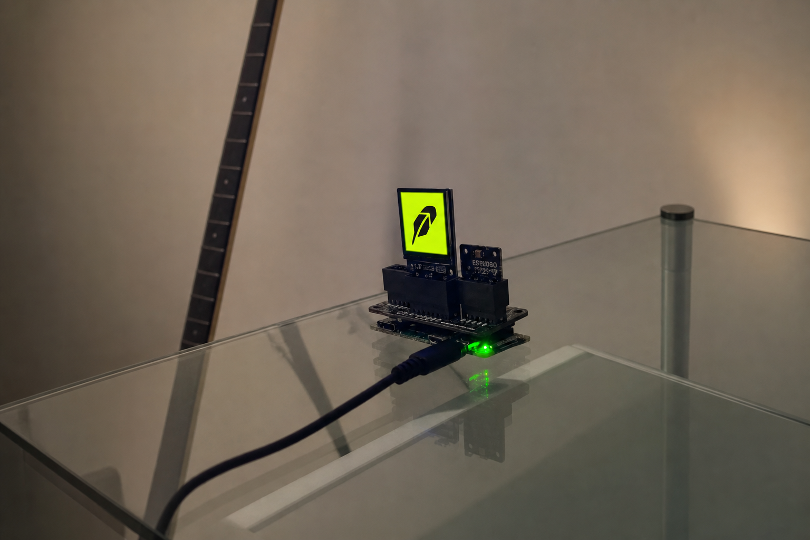

# Robindator

Robindator is a community memecoin experiment built around automated market
liquidity and a transparent buyback flywheel. The token uses NOXA for its
liquidity venue.

> [!IMPORTANT]
> Robindator is an independent community project. It is not affiliated with,
> endorsed by, or operated by Robinhood Markets, Inc. The name and visual
> references are used as part of the project's community theme.

## How it works

Robindator's market is based on the liquidity mechanics documented by NOXA:

- NOXA supports classic V2 pools and concentrated-liquidity V3 positions.
- V2 liquidity providers receive fungible LP tokens representing their share.
- V3 liquidity providers receive an NFT position and select a price range.
- NOXA Fun tokens use the 1% V3 fee tier by default.
- Initial NOXA Fun liquidity is created automatically and locked permanently.
- Additional liquidity can still be supplied independently by community
  members.

Read the canonical [NOXA liquidity documentation][noxa-liquidity] before
interacting with a pool.

## The flywheel

The project is testing a simple fee-funded loop:

1. Trading activity generates pool fees.
2. Eligible fees are collected by the designated treasury.
3. Treasury funds are used for announced market buybacks.
4. Buyback transactions are published for community verification.

The treasury does not unlock the initial liquidity position. Liquidity and
accrued fees are separate: a locked position can remain locked while eligible
fees are collected.

**Flywheel treasury:**  
`0xd42801b94ae6ead3d93a09b115d178c0ea1da3a3`

See [Flywheel policy](docs/FLYWHEEL.md) for the operating rules and limitations.

## Liquidity

The initial NOXA Fun LP is intended to provide a permanent baseline market.
Its underlying liquidity cannot be removed by the token creator. This does not
eliminate price volatility, impermanent loss, smart-contract risk, or token
risk.

For a practical explanation of V2, V3, fees, and locked positions, see
[Liquidity guide](docs/LIQUIDITY.md).

## Repository status

This repository currently serves as project documentation and preserves an
earlier Solana wallet-adapter prototype under `src/` and `lib/`. That prototype
is not the NOXA deployment, a Robinhood Chain validator, or evidence of an
on-chain token contract. Verified deployment addresses and transaction links
should be added to [Deployment records](docs/DEPLOYMENTS.md) before they are
presented as official.

## Verify, don't trust

Before trading:

- confirm the token contract address through an official project channel;
- inspect the pool and locker contracts in a block explorer;
- verify treasury actions on-chain;
- never treat community content as financial advice; and
- only risk funds you can afford to lose.

## Documentation

- [NOXA liquidity mechanics](docs/LIQUIDITY.md)
- [Flywheel policy](docs/FLYWHEEL.md)
- [Deployment records](docs/DEPLOYMENTS.md)
- [Security policy](SECURITY.md)
- [Contributing](CONTRIBUTING.md)

## Disclaimer

Robindator is experimental software and a speculative community token. Nothing
in this repository is financial, legal, or tax advice. No return, price support,
buyback frequency, liquidity level, or continued operation is guaranteed.

[noxa-liquidity]: https://docs.noxa.fi/dex/liquidity/
